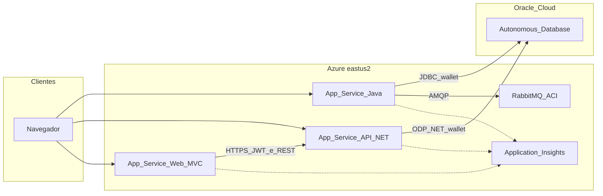

# SolarMetrics — DevOps e deploy na Microsoft Azure

Este repositório concentra o **script de infraestrutura e deploy**, **DDL de referência**, **documentação de arquitetura** e **amostras HTTP** para o ecossistema SolarMetrics. **O fluxo oficial é apenas o script Bash** [`deploy-azure-solarmetrics.sh`](deploy-azure-solarmetrics.sh).


https://solarmetrics-web.azurewebsites.net/


## Deploy único na Azure (recomendado)

| Recurso | Descrição |
|--------|-----------|
| [`deploy-azure-solarmetrics.sh`](deploy-azure-solarmetrics.sh) | Cria resource group, Application Insights, App Service Plan (Linux **B1**), **três Web Apps**, **RabbitMQ em ACI**, faz download do código (**tarball** GitHub ou `git clone`), build (`dotnet` / `mvn`) e **`az webapp deploy`** com **wallet Oracle** (`WALLET_URL` ou ficheiro local). |
| [`ddl/01_DDL_SolarMetrics.txt`](ddl/01_DDL_SolarMetrics.txt) | DDL texto para o Oracle (entrega). |
| [`docs/SOLUCAO-ARQUITETURA.md`](docs/SOLUCAO-ARQUITETURA.md) | Descrição da solução, diagrama e benefícios. |
| [`http/crud-samples/`](http/crud-samples/) | Exemplos JSON para testar APIs. |

### O que sobe na Azure

- **Web App Java 17** — API Spring Boot ([SolarMetrics-JavaAdvanced](https://github.com/ARC-ceo/SolarMetrics-JavaAdvanced)).
- **Web App .NET 8** — API ([SolarMetrics-Dotnet](https://github.com/bmvck/SolarMetrics-Dotnet) — `SolarMetrics.API`).
- **Web App .NET 8** — painel **MVC** (`SolarMetrics.Web` no mesmo repositório .NET).
- **Oracle Autonomous Database** — conexão via **wallet** nos pacotes de deploy.
- **RabbitMQ** — contentor em **Azure Container Instances** (integração com a API Java).
- **Application Insights** — telemetria ligada aos Web Apps.

### Autenticação do painel MVC (login)

O site **SolarMetrics.Web** obtém JWT em `POST /auth/token` na API .NET. Na API, o ambiente está configurado como **`Staging`** no App Service para esse endpoint não responder **404**. Use **`https://`** nas URLs ao testar (cookie seguro em produção).

```bash
chmod +x deploy-azure-solarmetrics.sh
./deploy-azure-solarmetrics.sh
```

Modo recomendado na nuvem: **Azure Cloud Shell** (Bash) + `WALLET_URL` apontando para o zip do wallet (HTTPS).

## Repositórios do ecossistema

| Repositório | Conteúdo |
|-------------|----------|
| [SolarMetrics-BancoDados](https://github.com/bmvck/SolarMetrics-BancoDados) | Scripts Oracle (DDL, dados, rotinas). |
| [SolarMetrics-JavaAdvanced](https://github.com/ARC-ceo/SolarMetrics-JavaAdvanced) | API Java / Spring Boot. |
| [SolarMetrics-Dotnet](https://github.com/bmvck/SolarMetrics-Dotnet) | API .NET 8, **SolarMetrics.Web** (MVC), testes. |
| **Este repositório** | Script `deploy-azure-solarmetrics.sh`, DDL, docs e amostras HTTP. |

## Arquitetura na Azure (visão geral)



## Variáveis úteis (resumo)

| Variável | Uso |
|----------|-----|
| `WALLET_URL` | HTTPS do `Wallet_*.zip` (preferido na Cloud Shell). |
| `WEBAPP_JAVA_NAME` / `WEBAPP_DOTNET_NAME` / `WEBAPP_WEB_NAME` | Nomes dos Web Apps (predefinidos: `solarmetrics-java`, `solarmetrics-api`, `solarmetrics-web`). |
| `GIT_URL_JAVA` / `GIT_URL_DOTNET` | URLs `.git` para tarball. |
| `USE_GIT_CLONE` | `1` usa `git clone`; `0` (padrão) usa tarball. |


## Sobre o time

- **Édipo Borges de Carvalho RM:567164**: Banco de dados e Compliance QA.  
- **Carlos Clementino RM:561187**: APIs Java e .NET, infraestrutura, DevOps e IoT.  
- **Eder Silva RM:559647**: Aplicação mobile.

---

**SolarMetrics** — Sua energia. Seu controle.
