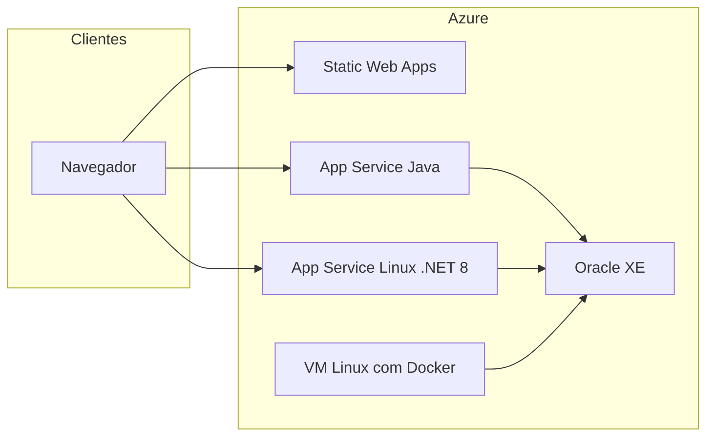

# SolarMetrics — Spring Boot, Next.js e DevOps na Azure

**SolarMetrics** é um projeto de monitoramento e análise de energia solar. Este repositório (**SolarMetrics-DevOps**) concentra o **back-end Java (Spring Boot)**, o **front-end Next.js (React)** e a **infraestrutura como código / documentação** para subir o ecossistema na **Microsoft Azure**, alinhado à Sprint 3 de cloud e ao padrão para Oracle em Docker.

## Repositórios do ecossistema

| Repositório | Conteúdo |
|-------------|----------|
| [SolarMetrics-BancoDados](https://github.com/bmvck/SolarMetrics-BancoDados) | Scripts Oracle (DDL, dados, funções, procedures, triggers). |
| [SolarMetrics-Dotnet](https://github.com/bmvck/SolarMetrics-Dotnet) | API .NET 8 (deploy em App Service Linux). |
| **Este repositório** | API Java (`solarmetrics-back`), front Next.js (`solarmetrics`), `azure/oracle` (Docker Oracle XE). |

## Arquitetura na Azure (visão geral)



- **Oracle:** container `gvenzl/oracle-xe:21-slim` na VM, scripts do repositório BancoDados carregados na primeira subida (ver [`azure/oracle/README.md`](azure/oracle/README.md)).
- **API Java:** App Service (Java 17), JAR gerado com Maven em `solarmetrics-back`.
- **API .NET:** App Service Linux, stack .NET 8, a partir do repositório SolarMetrics-Dotnet.
- **Front:** Azure Static Web Apps — build estático (`next build` com `output: 'export'`), pasta de saída `out`; o browser chama a API Java via `NEXT_PUBLIC_API_URL` (CORS já configurado no Spring).

**Região Azure:** use sempre **`eastus2`** para resource group, App Service Plans, Static Web Apps e VM (salvo orientação contrária da disciplina).

## Variáveis de ambiente principais

### API Java (App Service — Application settings)

| Setting | Exemplo | Descrição |
|---------|---------|-----------|
| `SPRING_PROFILES_ACTIVE` | `prod` | Ativa `application-prod.yml`. |
| `SPRING_DATASOURCE_URL` | `jdbc:oracle:thin:@//SEU_HOST_ORACLE:1521/GSDB` | JDBC Thin; use o host da VM ou DNS. |
| `SPRING_DATASOURCE_USERNAME` | `GSUSER` | Usuário do schema (ajuste ao seu compose). |
| `SPRING_DATASOURCE_PASSWORD` | (segredo) | Senha do usuário da aplicação. |

### Front Next.js (build e Static Web Apps)

| Variável | Descrição |
|----------|-----------|
| `NEXT_PUBLIC_API_URL` | URL pública da API Java (ex.: `https://seu-java.azurewebsites.net`), **sem** barra no final. |

Defina no build do SWA (GitHub Actions ou pipeline) ou no ambiente local antes de `yarn build` / `npm run build`.

### API .NET (SolarMetrics-Dotnet)

Use **Connection Strings** ou **Application settings** conforme o `appsettings` do projeto (ex.: `ConnectionStrings:OracleDb`). Não commite senhas; use User Secrets localmente e configuração do App Service na nuvem.

## Ordem recomendada de provisionamento

1. Resource group em **`eastus2`**.
2. **VM Linux** + instalar Docker e Docker Compose; subir [`azure/oracle`](azure/oracle) e validar porta **1521** (NSG restritivo quando possível).
3. **App Service (Java)** — deploy do JAR; configurar JDBC apontando para o host Oracle.
4. **App Service (.NET)** — `dotnet publish` e deploy do pacote.
5. **Static Web Apps** — build do front (`out`) e deploy do artefato.

## Deploy na Azure com Azure CLI

Pré-requisitos: [Azure CLI](https://learn.microsoft.com/cli/azure/install-azure-cli) instalado e login (`az login`).

Substitua `SUBSCRIPTION_ID`, `RG`, nomes de apps e host Oracle pelos seus valores. A região fixa deste projeto é **`eastus2`**.

### 1. Contexto da assinatura

```bash
az account set --subscription "SUBSCRIPTION_ID"
az group create --name RG --location eastus2
```

### 2. Oracle na VM (resumo)

- Crie uma VM Ubuntu, instale Docker e Docker Compose.
- Copie a pasta `azure/oracle` para a VM, ajuste variáveis se necessário e execute `docker compose up -d`.
- Anote o IP/DNS e o service name (ex.: `GSDB`).

### 3. App Service — API Java (Linux + Java 17)

```bash
az appservice plan create --name plan-solar-java --resource-group RG --location eastus2 --sku B1 --is-linux
az webapp create --resource-group RG --plan plan-solar-java --name APP_JAVA_NAME --runtime "JAVA:17-java17"
```

Build local do JAR:

```bash
cd solarmetrics-back
mvn -q -DskipTests package
```

Configure as variáveis `SPRING_*` e faça o deploy do `target/solarmetrics-0.0.1-SNAPSHOT.jar` (por exemplo com `az webapp deploy` ou pipeline CI/CD).

```bash
az webapp config appsettings set --resource-group RG --name APP_JAVA_NAME --settings \
  SPRING_PROFILES_ACTIVE=prod \
  SPRING_DATASOURCE_URL="jdbc:oracle:thin:@//ORACLE_HOST:1521/GSDB" \
  SPRING_DATASOURCE_USERNAME="GSUSER" \
  SPRING_DATASOURCE_PASSWORD="SUA_SENHA"
```

### 4. App Service — API .NET 8 (Linux)

```bash
az appservice plan create --name plan-solar-dotnet --resource-group RG --location eastus2 --sku B1 --is-linux
az webapp create --resource-group RG --plan plan-solar-dotnet --name APP_NET_NAME --runtime "DOTNETCORE:8.0"
```

No repositório [SolarMetrics-Dotnet](https://github.com/bmvck/SolarMetrics-Dotnet), gere o publish e envie para o App Service (ZIP deploy ou `az webapp deploy`), configurando connection string / settings do Oracle.

### 5. Static Web Apps — front Next.js

```bash
az staticwebapp create \
  --name swa-solar-front \
  --resource-group RG \
  --location eastus2 \
  --sku Free
```

Gere o site estático:

```bash
cd solarmetrics
set NEXT_PUBLIC_API_URL=https://APP_JAVA_NAME.azurewebsites.net
yarn install
yarn build
```

O conteúdo publicável está em `out/` (inclui `staticwebapp.config.json` copiado de `public/`). Use o fluxo de deploy do SWA (GitHub Actions gerado pelo portal, extensão **Azure Static Web Apps CLI** `swa deploy`, ou upload conforme a documentação atual da Microsoft).

## Execução local (Docker Compose)

Na raiz do repositório:

```bash
docker compose up -d --build
```

- Back-end: `http://localhost:8080`
- Front: `http://localhost:3000` (imagem serve a pasta `out` com `serve`; `NEXT_PUBLIC_API_URL` aponta para `http://backend:8080` no build).

## Sobre o time

- **Édipo Borges de Carvalho RM:567164**: Responsável pelo banco de dados e Compliance QA.  
- **Carlos Clementino RM:561187**: Responsável pelo desenvolvimento da API em Java Spring Boot e .NET, infraestrutura e práticas de DevOps, e pela integração com dispositivos IoT.  
- **Eder Silva RM:559647**: Responsável pela criação do APP mobile.

---

**SolarMetrics** — Sua energia. Seu controle.
