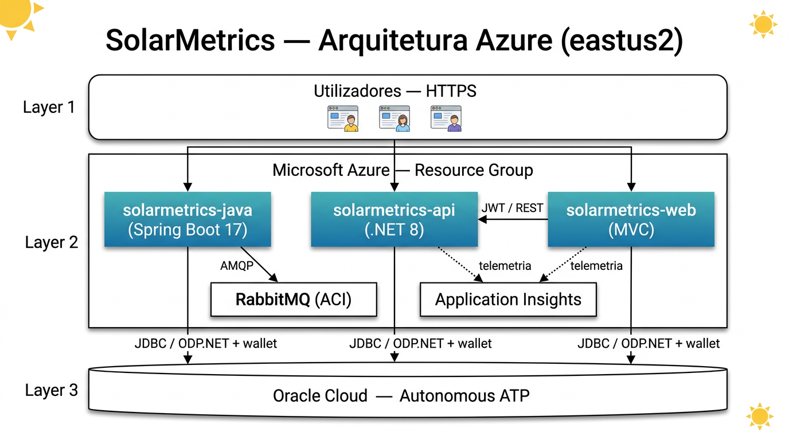
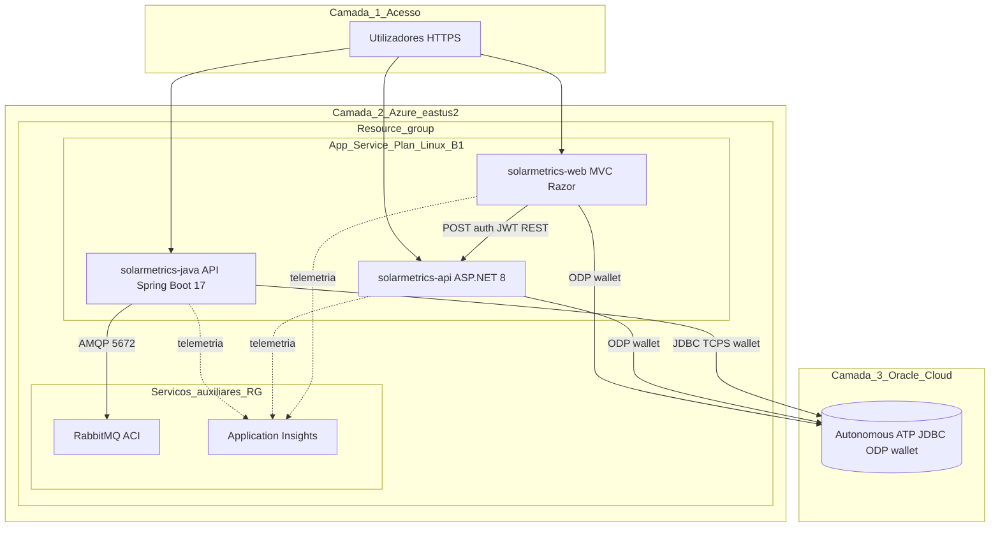

# SolarMetrics — DevOps e deploy na Microsoft Azure

Este repositório concentra o **script de infraestrutura e deploy**, a **pipeline CI/CD Azure DevOps** (YAML único), **DDL de referência**, **documentação de arquitetura** e **amostras HTTP** para o ecossistema SolarMetrics.

Video Demonstração: https://vimeo.com/1182450375


## Deploy único na Azure (recomendado)

| Recurso | Descrição |
|--------|-----------|
| [`deploy-azure-solarmetrics.sh`](deploy-azure-solarmetrics.sh) | Cria resource group, Application Insights, App Service Plan (Linux **B1**), **três Web Apps**, **RabbitMQ em ACI**, faz download do código (**tarball** GitHub ou `git clone`), build (`dotnet` / `mvn`) e **`az webapp deploy`** com **wallet Oracle** (`WALLET_URL` ou ficheiro local). |
| [`ddl/01_DDL_SolarMetrics.txt`](ddl/01_DDL_SolarMetrics.txt) | DDL texto para o Oracle (entrega). |
| [`docs/SOLUCAO-ARQUITETURA.md`](docs/SOLUCAO-ARQUITETURA.md) | Descrição da solução, diagrama e benefícios. |
| [`http/crud-samples/`](http/crud-samples/) | Exemplos JSON para testar APIs. |

### O que sobe na Azure

- **Web App Java 17** — API Spring Boot ([SolarMetrics-JavaAdvanced](https://github.com/ARC-ceo/SolarMetrics-JavaAdvanced)).
- **Web App .NET 8** — API ([SolarMetrics-Dotnet](https://github.com/bmvck/SolarMetrics-Dotnet) — `SolarMetrics.API`).
- **Web App .NET 8** — painel **MVC** (`SolarMetrics.Web` no mesmo repositório .NET).
- **Oracle Autonomous Database** — conexão via **wallet** nos pacotes de deploy.
- **RabbitMQ** — contentor em **Azure Container Instances** (integração com a API Java).
- **Application Insights** — telemetria ligada aos Web Apps.

### Autenticação do painel MVC (login)

O site **SolarMetrics.Web** obtém JWT em `POST /auth/token` na API .NET. Na API, o ambiente está configurado como **`Staging`** no App Service para esse endpoint não responder **404**. Use **`https://`** nas URLs ao testar (cookie seguro em produção).

```bash
chmod +x deploy-azure-solarmetrics.sh
./deploy-azure-solarmetrics.sh
```

Modo recomendado na nuvem: **Azure Cloud Shell** (Bash) + `WALLET_URL` apontando para o zip do wallet (HTTPS).

## Pipeline Azure DevOps (CI/CD — arquivo único)

| Recurso | Descrição |
|--------|-----------|
| [`azure-pipelines.yml`](azure-pipelines.yml) | Pipeline única com 3 stages: `criarInfra` → `BuildApp` → `DeployApp` (stack Java + .NET API + MVC + RabbitMQ + Oracle). |
| [`docs/PIPELINE-CI-CD.md`](docs/PIPELINE-CI-CD.md) | Desenho da pipeline, dissertação de cada etapa e roteiro de testes (entrega challenge). |
| [`step-by-step-cloud/step-by-step-pipeline/STEP-BY-STEP-PIPELINE-2026-05-22.md`](step-by-step-cloud/step-by-step-pipeline/STEP-BY-STEP-PIPELINE-2026-05-22.md) | Passo a passo no portal Azure DevOps (GitHub ou Azure Repos). |

### Pré-requisitos

1. Organização/projeto Azure DevOps (ex.: `Challenge-SolarMetrics` / `SolarMetrics`).
2. **Service connection** Azure Resource Manager — nome padrão no YAML: `MyAzureSubscription` (assinatura *Azure for Students* ou a sua).
3. **Variables** na pipeline (marque como secret onde indicado):

| Variável | Secret | Descrição |
|----------|--------|-----------|
| `WALLET_URL` | Sim | HTTPS do `Wallet_*.zip` (Blob SAS ou link temporário). **Não** commitar o zip. |
| `ORACLE_PASSWORD` | Sim | Senha do usuário Oracle (`ADMIN`). |
| `JWT_KEY` | Opcional | Chave JWT; se vazio, usa o padrão acadêmico do script. |

4. (Opcional) Ajuste `webappApi`, `webappJava`, `webappWeb` no YAML ou em Variables se os nomes globais já estiverem ocupados na Azure (sufixo RM).

### Como criar e executar a pipeline

1. **Pipelines** → **Create Pipeline** → escolha **GitHub** ou **Azure Repos** (ver step-by-step).
2. Selecione este repositório e o arquivo **`/azure-pipelines.yml`** na branch `main`.
3. **Save and run** — na primeira execução, confirme as variables secretas.
4. Aguarde os três stages em verde; use as URLs impressas no log do stage **DeployApp**.

### Testar CRUD após a pipeline

1. Swagger: `https://<webappApi>.azurewebsites.net/swagger`
2. `POST /Cliente` com JSON em [`http/crud-samples/dotnet-post-cliente.json`](http/crud-samples/dotnet-post-cliente.json)
3. Oracle: `SELECT * FROM SM_USUARIO;` — relacionamento com `SM_SISTEMA` via `CLIENTE_ID` (ver [SolarMetrics-BancoDados](https://github.com/bmvck/SolarMetrics-BancoDados))

Alternativa sem DevOps: o script [`deploy-azure-solarmetrics.sh`](deploy-azure-solarmetrics.sh) executa o mesmo fluxo manualmente.

## Repositórios do ecossistema

| Repositório | Conteúdo |
|-------------|----------|
| [SolarMetrics-BancoDados](https://github.com/bmvck/SolarMetrics-BancoDados) | Scripts Oracle (DDL, dados, rotinas). |
| [SolarMetrics-JavaAdvanced](https://github.com/ARC-ceo/SolarMetrics-JavaAdvanced) | API Java / Spring Boot. |
| [SolarMetrics-Dotnet](https://github.com/bmvck/SolarMetrics-Dotnet) | API .NET 8, **SolarMetrics.Web** (MVC), testes. |
| **Este repositório** | Script `deploy-azure-solarmetrics.sh`, DDL, docs e amostras HTTP. |

## Arquitetura na Azure (visão geral)

Visão em **camadas** (tipo organograma): utilizadores → aplicações no **mesmo App Service Plan** → serviços de suporte na assinatura → **Oracle ATP** fora da Azure. O **wallet** TLS acompanha os pacotes publicados nas Web Apps.





**Legenda dos fluxos**

| Fluxo | Descrição |
|-------|-----------|
| Setas cheias | Tráfego de aplicação: **HTTPS** do cliente às APIs e ao MVC; **REST + JWT** do painel MVC para a API .NET; **JDBC / ODP.NET** com wallet para o Oracle; **AMQP** da API Java para o RabbitMQ. |
| Linhas tracejadas | **Telemetria** (requests, dependências, exceções) enviada ao Application Insights. |
| Três Web Apps | Partilham o **mesmo plano B1**; nomes configuráveis (`WEBAPP_*`). |

## Variáveis úteis (resumo)

| Variável | Uso |
|----------|-----|
| `WALLET_URL` | HTTPS do `Wallet_*.zip` (preferido na Cloud Shell). |
| `WEBAPP_JAVA_NAME` / `WEBAPP_DOTNET_NAME` / `WEBAPP_WEB_NAME` | Nomes dos Web Apps (predefinidos: `solarmetrics-java`, `solarmetrics-api`, `solarmetrics-web`). |
| `GIT_URL_JAVA` / `GIT_URL_DOTNET` | URLs `.git` para tarball. |
| `USE_GIT_CLONE` | `1` usa `git clone`; `0` (padrão) usa tarball. |


## Sobre o time

- **Édipo Borges de Carvalho RM:567164**: Banco de dados e Compliance QA.  
- **Carlos Clementino RM:561187**: APIs Java e .NET, infraestrutura, DevOps e IoT.  
- **Eder Silva RM:559647**: Aplicação mobile.

---

**SolarMetrics** — Sua energia. Seu controle.
