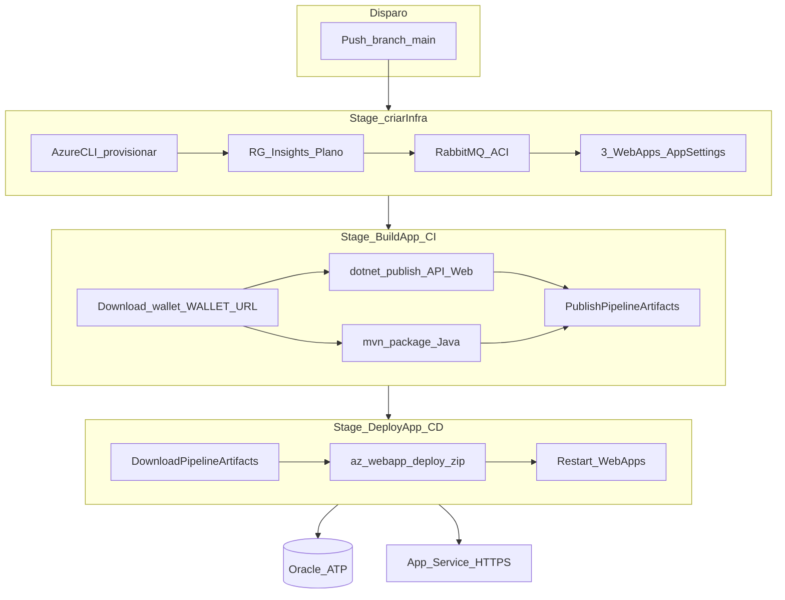

# SolarMetrics — Pipeline CI/CD (Azure DevOps)

## Descrição da solução (resumo)

O **SolarMetrics** monitora sistemas de energia solar. A pipeline automatiza o provisionamento na **Microsoft Azure**, o build das aplicações (**Java Spring Boot**, **API .NET 8** e **MVC .NET**) e o deploy com **wallet Oracle** para o **Oracle Autonomous Database** (ATP). Um **RabbitMQ** em **Azure Container Instances** integra a API Java. O arquivo único [`azure-pipelines.yml`](../azure-pipelines.yml) concentra CI e CD, no mesmo espírito do script [`deploy-azure-solarmetrics.sh`](../deploy-azure-solarmetrics.sh).

Repositórios de aplicação (baixados na pipeline via tarball GitHub):

| Repositório | Papel |
|-------------|--------|
| [SolarMetrics-JavaAdvanced](https://github.com/ARC-ceo/SolarMetrics-JavaAdvanced) | API Spring Boot |
| [SolarMetrics-Dotnet](https://github.com/bmvck/SolarMetrics-Dotnet) | API + SolarMetrics.Web |
| [SolarMetrics-BancoDados](https://github.com/bmvck/SolarMetrics-BancoDados) | DDL Oracle (`SM_USUARIO`, `SM_SISTEMA`, …) |

## Desenho da pipeline

### Fluxo de dados

1. **Trigger:** push na branch `main` do repositório que contém o YAML (SolarMetrics-DevOps).
2. **Infra:** idempotente — cria ou reutiliza recursos existentes.
3. **Build:** não usa checkout do código das APIs no repositório da pipeline; baixa `main` dos GitHubs públicos, compila e gera três ZIPs (API, MVC, Java+wallet).
4. **Deploy:** publica os ZIPs nas Web Apps e reinicia os sites.
5. **Persistência:** APIs e MVC conectam ao Oracle via wallet; CRUD de demonstração em [`http/crud-samples/`](../http/crud-samples/).

## Detalhamento por stage (dissertação)

### Stage 1 — `criarInfra` (entrega contínua de infraestrutura)

| Elemento | Função |
|----------|--------|
| **Job** `provisionarRecursos` | Executa um único job no agente `ubuntu-latest`. |
| **Task** `AzureCLI@2` | Usa a service connection Azure (`MyAzureSubscription` por padrão) para rodar comandos `az` autenticados. |
| **Resource Group** | `rg-solarmetrics-cloud` em `eastus2` — agrupa todos os recursos do challenge. |
| **Application Insights** | Telemetria das três Web Apps. |
| **App Service Plan** | Linux **B1** — hospeda Java 17 e .NET 8 no mesmo plano. |
| **RabbitMQ (ACI)** | Container `rabbitmq:3-management` com DNS `solarmetrics-rmq` para filas AMQP da API Java. |
| **Web Apps** | `solarmetrics-java`, `solarmetrics-api`, `solarmetrics-web` com runtimes adequados. |
| **App Settings** | JDBC/ODP Oracle, credenciais Rabbit, connection string do Insights; API .NET em **Staging** para habilitar `POST /auth/token` (login do MVC). |

Este stage é **CD de infraestrutura**: garante que o destino do deploy existe e está configurado antes do build.

### Stage 2 — `BuildApp` (integração contínua)

| Step | Função |
|------|--------|
| **Preparar wallet** | `curl` em `WALLET_URL` (secret), extrai `tnsnames.ora` e monta `wallet-flat`. |
| **UseDotNet@2** | Instala SDK 8 para `dotnet publish`. |
| **Build API .NET** | Tarball `SolarMetrics-Dotnet` → publish `SolarMetrics.API` → copia wallet → ZIP → artefato `solarmetrics-api`. |
| **Build MVC .NET** | Mesmo clone → publish `SolarMetrics.Web` → wallet → ZIP → artefato `solarmetrics-web`. |
| **Build Java** | Tarball `SolarMetrics-JavaAdvanced` → `mvn package` → `app.jar` + wallet → ZIP → artefato `solarmetrics-java` (melhor esforço; falha não bloqueia API/MVC). |

Este stage é **CI**: compila, empacota e publica artefatos versionados na execução da pipeline.

### Stage 3 — `DeployApp` (entrega contínua da aplicação)

| Step | Função |
|------|--------|
| **DownloadPipelineArtifact@2** | Recupera os três ZIPs (Java opcional). |
| **Deploy API / Web / Java** | `az webapp deploy --type zip`; fallback **Kudu** `/api/zipdeploy` se OneDeploy retornar erro. |
| **Restart + URLs** | Reinicia as apps e imprime endpoints para teste e gravação do vídeo. |

Este stage é **CD da aplicação**: leva os binários produzidos no CI até o App Service em produção acadêmica.

## Variáveis e segredos

| Nome | Onde definir | Uso |
|------|----------------|-----|
| `WALLET_URL` | Pipeline → Variables (**secret**) | HTTPS do `Wallet_*.zip` Oracle |
| `ORACLE_PASSWORD` | Variables (**secret**) | Senha ADMIN ATP |
| `JWT_KEY` | Variables (opcional, secret) | JWT da API .NET / MVC |
| `webappApi`, `webappJava`, … | `azure-pipelines.yml` ou Variables | Sufixo RM se nomes globais estiverem ocupados |
| `azureServiceConnection` | YAML | Nome da service connection (padrão `MyAzureSubscription`) |

## Testes após a pipeline

1. Abrir `https://<webappApi>.azurewebsites.net/swagger`.
2. `POST /Cliente` com [`http/crud-samples/dotnet-post-cliente.json`](../http/crud-samples/dotnet-post-cliente.json).
3. No Oracle: `SELECT * FROM SM_USUARIO;` e `SELECT * FROM SM_SISTEMA;` (relacionamento **Cliente → Sistema**).

## Relação com o script manual

O script [`deploy-azure-solarmetrics.sh`](../deploy-azure-solarmetrics.sh) continua válido para deploy pontual (Cloud Shell). A pipeline reproduz a mesma sequência lógica em três stages para avaliação **DevOps Tools e Cloud Computing** (itens 2, 3 e 5 do challenge).

## Manutenibilidade

- **Um YAML** facilita revisão e entrega acadêmica.
- **Tarball GitHub** evita configurar múltiplos repositórios na pipeline.
- **Stages com `dependsOn`** deixam explícita a ordem infra → build → deploy.
- **Próximo passo:** extrair scripts bash longos para `pipeline/scripts/` se o YAML crescer além do confortável de diff.
