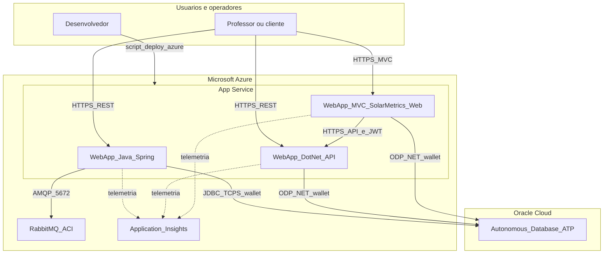

# SolarMetrics na Azure — descrição da solução, arquitetura e benefícios

## Descrição da solução

A solução **SolarMetrics** monitora sistemas de energia solar. Nesta entrega em nuvem, a **API Java (Spring Boot)**, a **API .NET 8** e a aplicação web **MVC (SolarMetrics.Web)** são implantadas em **Azure App Service (Linux)** no mesmo plano, conectando-se ao **Oracle Autonomous Database** (ATP) na Oracle Cloud usando **wallet TLS**. O painel MVC consome a API .NET (REST e JWT). Um **RabbitMQ** em **Azure Container Instances** atende à integração assíncrona (e-mail/filas) prevista na API Java. O **Application Insights** coleta telemetria das aplicações.

Repositórios vinculados ao deploy:

- Java: [https://github.com/ARC-ceo/SolarMetrics-JavaAdvanced](https://github.com/ARC-ceo/SolarMetrics-JavaAdvanced)
- .NET: [https://github.com/bmvck/SolarMetrics-Dotnet](https://github.com/bmvck/SolarMetrics-Dotnet)
- DDL / scripts de banco: [https://github.com/bmvck/SolarMetrics-BancoDados](https://github.com/bmvck/SolarMetrics-BancoDados)

O provisionamento da infraestrutura Azure está centralizado no script [`deploy-azure-solarmetrics.sh`](../deploy-azure-solarmetrics.sh).

## Desenho da arquitetura

Fluxo da informação (resumo):

1. Utilizadores acedem às APIs e ao painel **MVC** pelos Web Apps (HTTPS).
2. As APIs e a aplicação MVC persistem e consultam dados no **Oracle ATP** (ex.: entidades com relacionamento **Cliente → Sistema** mapeadas em `SM_USUARIO` / `SM_SISTEMA`).
3. A API Java publica/consome mensagens no **RabbitMQ** quando os fluxos de domínio exigem processamento assíncrono.
4. Métricas e logs são enviados ao **Application Insights** para observabilidade.

## Benefícios ao negócio

- **Disponibilidade**: hospedagem gerenciada (App Service) com opção de escalonamento vertical/horizontal conforme demanda de sensores e usuários.
- **Confiabilidade de dados**: Oracle ATP oferece backup, alta disponibilidade e segurança em camadas para dados de cadastro e monitoramento.
- **Time-to-market**: o script `deploy-azure-solarmetrics.sh` automatiza clone, build e `az webapp deploy`, reduzindo passos manuais para nova publicação.
- **Visibilidade operacional**: Application Insights facilita diagnóstico de falhas e desempenho das APIs e do painel web em produção.
- **Custo previsível (acadêmico)**: uso de SKUs de entrada (ex.: `B1`, RabbitMQ em ACI pequeno) adequados a demonstrações e cargas moderadas.

## Próximos passos sugeridos

- Armazenar segredos no **Azure Key Vault** e referenciar nas configurações dos Web Apps.
- Restringir rede do RabbitMQ (IP allowlist) ou evoluir para serviço gerenciado conforme requisitos de segurança.
- Testes de carga e definição de SLIs/SLOs com base nas métricas do Application Insights.
